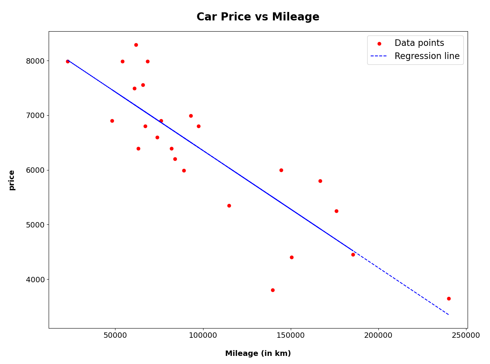
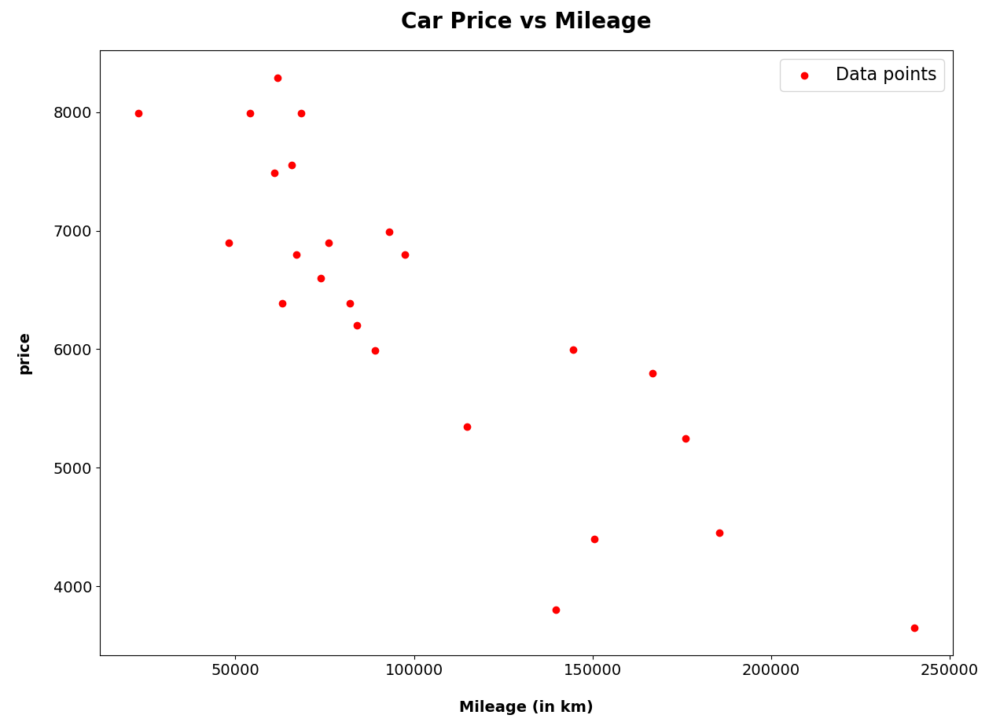

# ft_linear_regression
## Overview

The project trains a linear regression model to predict car prices based on mileage using a dataset of mileage-price pairs. The dataset is stored in `data.csv`.

The project includes:
- **Training Program**: Trains the model and saves parameters for future use.
- **Prediction Program**: Predicts car prices for given mileage values.
- **Precision Evaluation Program**: Calculates the precision of the model by comparing predicted prices with actual prices.

---
## Gradient Descent: Simultaneous Updates

### theta1
- The **slope** (theta1) represents the change in price per km.
- It is normal for theta1 to be a small value if the scale of the input feature (mileage) is much larger than the scale of the target variable.
> For example, if theta1 = −0.021, it means:
For every 1 km increase, the price decreases by 0.021 currency units.  
Over a larger range (e.g., 10,000 km), the effect becomes noticeable:
Price decrease = 10,000⋅(−0.021) = −210 currency units.

```
tmpθ1 = learningRate * (1 / m) * Σ (estimatePrice(mileage[i])-price[i])* mileage[i]
```

### theta0
- The intercept (theta0) represents the base price when mileage is 0.
>For example, if theta0 = 8499.53, it is the price when the car is new.

```
tmpθ0 = learningRate * (1 / m) * Σ(estimatePrice(mileage[i])- price[i])
```
The parameters are then adjusted:

```
theta0 -= temp0
theta1 -= temp1
```
The loop continues until the parameter adjustments are smaller than a defined threshold (1e-3)
```
if abs(temp0) < epsilon and abs(temp1) < epsilon:
    break
```
---

### Why normalization is needed:
- Without normalization, features with large values (mileage) dominate features with smaller values (price).
- Gradient descent may take longer to converge or might not converge at all because the cost function’s shape becomes highly skewed.  

Z-Score Normalization Formula:
```
z = (x - mean) / std
```
Where:
- z: The normalized value.
- x: The original mileage value.
- mean: The average of all mileage values.
- std: The standard deviation of the mileage values

### Reverting Normalization
- After training, the parameters (theta0, theta1) derived from normalized data must be reverted to the original scale for predictions to make sense. This ensures:

1. The slope is scaled correctly for the original mileage range.
2. The intercept with the actual price values.
```
theta0 = estimated_intercept−(estimated_slope⋅std_mileagemean_mileage)
theta0 = std_mileage/estimated_slope
```
---

## Precision Algorithm
- The precision of the algorithm is evaluated using the Mean Absolute Error (MAE) in percentage. 
- This is calculated by comparing the predicted prices with the actual prices from the dataset:
```
total_error = sum(abs((p - a) / a) for p, a in zip(predicted_p, actual_p))
mae_percentage = total_error / len(actual_p) * 100
```
- **Smaller MAE Percentage**: Indicates the model is better at predicting prices.
- **Larger MAE Percentage**: Suggests the model is less precise, potentially due to underfitting or overfitting.

## **Setup**

### Install requirements
This project requires Python and the following libraries:
- `numpy`
- `pandas`
- `matplotlib`


### Run the program 

**` python3 training.py`**: Trains the regression model and plots the results in a graph.



**`python3 training.py -d`**: Displays a graph of the distribution of the data (no training).



**`python3 predict.py`**: Predicts car prices based on user-input mileage.

**`python3 precision.py`**: Calculates and displays the precision of the regression model.

